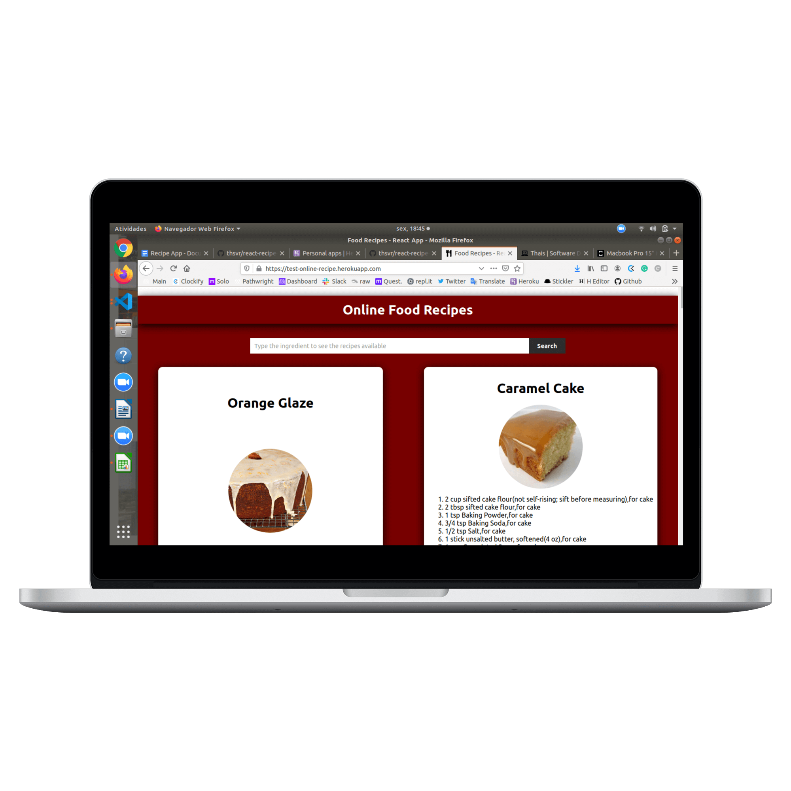

## React App - Food Recipes App -  [Live Version](https://test-online-recipe.herokuapp.com/)

This simple app allows users to access different recipes of food by typing the name of the food on the input search. The recipies was got by an API.

  

## Technologies

This project was built using these technologies.

- React
- Javascript
- NPM
- CSS3

 
 

## Prerequisites

- Node
- NPM

 
 

## Installation

Download or clone the [repo here](https://github.com/thsvr/react-recipe-tut.), enter the directory in the terminal and run the commands:

- `$ cd react-recipe-tut./my-app`
- `$ npm init`
- `$ npm start`
- Your default browser should open the app at the localhost:3000

 
 
 
 

👤 **Thaís Vieira Azevedo**

- Portfolio: [Thais's Portfolio](https://thais-software-developer.netlify.com/)
- Github: [@thsvr](https://github.com/thsvr)
- Twitter: [@vr_ths](https://twitter.com/vr_ths)
- Linkedin: [Thaís V.](https://www.linkedin.com/in/vr-ths-zd/)
- Email: [vr.ths.zd@gmail.com](vr.ths.zd@gmail.com)

 
 

- This app was created following <a href="https://www.youtube.com/watch?v=U9T6YkEDkMo">this tutorial of Dev Ed channel</a>.
- The icons used were taken on <a href="https://fontawesome.com/icons?d=gallery&q=food">Fontawsome</a>
- The API used was got on <a href="https://developer.edamam.com/">Edamam API</a>
